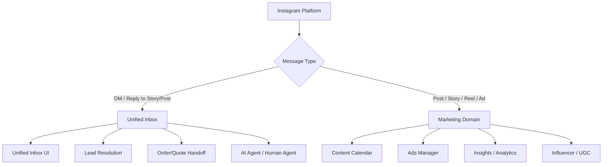

# معماری مرکز ارتباطات یکپارچه (Unified Communications)

**نسخه:** 1.0  
**تاریخ:** ۱۴۰۵/۰۵/۱۲  
**وضعیت:** مستند معماری — قابل نسخه‌برداری و استناد در توسعه‌های آینده

---

## ۱. هدف (Goal)

ایجاد یک **مرکز ارتباطات یکپارچه (Unified Communications Hub)** که تمام کانال‌های ورودی و خروجی ارتباطی با مشتری/لید را در یک نمایه واحد (Unified Inbox) tập trung کند، باعث شود:

- تیم فروش/پشتیبانی یک دید واحد از تاریخچه مکالمه داشته باشد
- انتقال داده (Lead → Customer → Order/Quote) بدون گم‌شدن context انجام شود
- ایجنت‌های خودکار (AI Agent) بتوانند روی تمام کانال‌ها به صورت یکپارچه عمل کنند
- تفکیک واضح بین **ارتباطات عملیاتی/تراکنشی** (در Unified Inbox) و **بازاریابی/تولید محتوا** (در دامنه Marketing) حفظ شود

---

## ۲. دامنه (Scope)

### در دامنه Unified Communications (این سند)

| دسته | مثال‌ها | وضعیت |
|------|---------|-------|
| **کانال‌های ورودی/خروجی پیام‌رسانی** | WhatsApp (Cloud API), Instagram DM, Telegram Bot, SMS, Email, Web Chat | Partial / Planned |
| **Unified Inbox** | نمایه واحد برای تیم داخلی در `messenger-app` و `admin-panel` | Existing (Internal) / Planned (External) |
| **Lead/Customer Resolution** | تطبیق لید ورودی با `crm_customers` یا ایجاد Lead جدید | Planned |
| **Order/Quote Handoff** | انتقال سفارش/پیش‌فاکتور از چت به `crm_orders` / `crm_quotes` | Planned |
| **Conversation State Machine** | Open, Pending, Resolved, Escalated, Bot-Handoff | Planned |
| **Agent Orchestration** | Routing هوشمند به ایجنت انسانی / AI Agent / Bot | Planned |
| **SLA & Routing Rules** | اولویت‌بندی، эскаلشن، تخصیص به صف/تیم | Planned |
| **Audit & Compliance** | ذخیره کامل تاریخچه، امضای دیجیتال، نگهداری قانونی | Planned |

### خارج از دامنه (Marketing Domain)

| فعالیت | مالک | توضیح |
|--------|------|-------|
| **تولید محتوای اینستاگرام** | Marketing Team | پست‌ها، استوری‌ها، ریلز، کاور |
| **کمپین‌های تبلیغاتی** | Marketing / Ads Manager | Meta Ads، تبلیغات هدفمند، retargeting |
| **تحلیل بازاریابی** | Marketing Analytics | Insights، engagement rate، reach، demographic |
| **Influencer Collaboration** | Marketing | مشارکت‌ها، همکاران، UGC |
| **Brand Voice & Guideline** | Marketing |tono of voice، style guide، تقویم محتوا |
| **Social Listening (Non-transactional)** | Marketing | مانیتور برند، sentiment analysis عمومی |

> **قاعده طلایی:** اگر پیام **هدف تراکنشی/عملیاتی** دارد (سفارش، پشتیبانی، پیش‌فاکتور، تیکت) → در **Unified Inbox**. اگر هدف **برندینگ/بازاریابی/تولید محتواست** → در **Marketing**.

---

## ۳. کانال‌ها (Channels)

| کانال | 프로توکل/API | جهت | وضعیت | یادداشت |
|--------|-------------|------|-------|---------|
| **WhatsApp Business (Cloud API)** | Meta Graph API / Webhook | دوطرفه | **Existing** (whatsapp-broadcast-api) | ارسال انبوه + Inbox |
| **Instagram DM** | Meta Graph API / Messenger API | دوطرفه | **Planned** | در Unified Inbox، نه Marketing |
| **Telegram Bot** | Bot API / Webhook | دوطرفه | **Planned** | برای پشتیبانی داخلی/خارجی |
| **SMS (Unipay/Faraz/Chapp)** | REST API | خروجی / ورودی (کد کوتاه) | **Partial** | فقط OTP/نوتیفیکیشن الان |
| **Email (SMTP/IMAP/SendGrid)** | SMTP + Webhook | دوطرفه | **Planned** | تیکتینگ، اطلاع‌رسانی |
| **Web Chat (Widget)** | WebSocket / SSE | دوطرفه | **Planned** | ادمین‌پنل، سایت عمومی |
| **Internal Messenger** | WebSocket (داخلی) | دوطرفه | **Existing** | `messenger-app`، `admin-panel` |

> **نکته:** Instagram DM از نظر فنی همان Meta Messenger API است. در این معماری **فقط بخش DM** در Unified Inbox قرار می‌گیرد. پست‌ها، استوری‌ها، تبلیغات و insights در Marketing بماند.

---

## ۴. مرز Unified Inbox و Marketing (Boundary)



| معیار | Unified Inbox | Marketing |
|-------|---------------|-----------|
| **هدف** | تبدیل مکالمه به تراکنش (Order/Quote/Ticket) | برندینگ، جذب، تعامل، تحلیل |
| **مالک** | Sales / Support / Operations | Marketing / Growth |
| **متریک** | Response Time, Conversion Rate, SLA | Reach, Engagement, CPM, ROAS |
| **Data Store** | `crm_conversations`, `crm_messages`, `leads` | `marketing_posts`, `ads_campaigns`, `insights` |
| **Instagram DM** | ✅ بله | ❌ خیر |
| **Instagram Post/Story/Reel** | ❌ خیر | ✅ بله |
| **Instagram Ads** | ❌ خیر | ✅ بله |
| **Instagram Insights** | ❌ خیر | ✅ بله |

---

## ۵. مدل مفهومی داده (Conceptual Data Model)

### موجودیت‌های اصلی (Entities)

```typescript
// موجودیت‌های موجود در crm (Supabase)
interface Conversation {
  id: string;                    // UUID
  channel: ChannelType;          // 'whatsapp' | 'instagram_dm' | 'telegram' | 'email' | 'web_chat' | 'internal'
  external_thread_id: string;    // ID در پلتفرم منبع (wa_id, ig_thread_id, tg_chat_id)
  participant: Participant;      // اطلاعات طرف مقابل
  status: ConversationStatus;    // 'open' | 'pending' | 'resolved' | 'closed' | 'escalated' | 'bot_handoff'
  assignee_id?: string;          // ایجنت/تیم مسئول (FK → users)
  team_id?: string;              // تیم/دپارتمان (FK → groups)
  priority: Priority;            // 'low' | 'normal' | 'high' | 'urgent'
  tags: string[];                // برچسب‌های دسته‌بندی
  sla_deadline?: timestamp;      // مهلت SLA
  created_at: timestamp;
  updated_at: timestamp;
  closed_at?: timestamp;
  metadata: JSON;                // داده‌های اضافی کانال
}

interface Message {
  id: string;                    // UUID
  conversation_id: string;       // FK → Conversation
  direction: 'inbound' | 'outbound';
  sender_type: 'customer' | 'agent' | 'bot' | 'system';
  sender_id?: string;            // FK → users (اگر agent/bot)
  content_type: ContentType;     // 'text' | 'image' | 'document' | 'audio' | 'video' | 'location' | 'contact' | 'template' | 'interactive'
  content: string;               // متن یا caption
  media_url?: string;            // برای فایل‌ها
  external_message_id: string;   // ID در پلتفرم منبع
  status: MessageStatus;         // 'sent' | 'delivered' | 'read' | 'failed'
  timestamp: timestamp;
  reply_to_id?: string;          // FK → Message (برای reply/thread)
  ai_generated: boolean;         // آیا توسط AI تولید شده
  metadata: JSON;
}

interface Participant {
  external_id: string;           // wa_id / ig_user_id / tg_user_id / email
  name?: string;
  phone?: string;
  email?: string;
  avatar_url?: string;
  source_channel: ChannelType;
  crm_customer_id?: number;      // FK → crm_customers (بعد از Resolution)
  lead_id?: string;              // FK → leads (اگر هنوز customer نشده)
  attributes: JSON;              // اطلاعات غنی‌سازی شده
}

interface Lead {
  id: string;                    // UUID
  source: LeadSource;            // 'whatsapp' | 'instagram_dm' | 'web_form' | 'referral' | 'phone'
  conversation_id?: string;      // FK → Conversation (اگر از چت شروع شده)
  participant: Participant;      // اطلاعات تماس
  status: LeadStatus;            // 'new' | 'contacted' | 'qualified' | 'unqualified' | 'converted' | 'lost'
  assigned_to?: string;          // FK → users
  interest_products: string[];   // محصولات مورد علاقه
  estimated_value?: number;      // ارزش تقریبی
  notes: string;
  created_at: timestamp;
  updated_at: timestamp;
  converted_customer_id?: number; // FK → crm_customers (بعد از تبدیل)
  converted_order_id?: string;   // FK → crm_orders
}
```

### Enumها

```typescript
type ChannelType = 'whatsapp' | 'instagram_dm' | 'telegram' | 'email' | 'web_chat' | 'internal' | 'sms';

type ConversationStatus = 
  | 'open'           // جدید، منتظر تخصیص
  | 'pending'        // در حال پردازش توسط agent/bot
  | 'awaiting_customer' // منتظر پاسخ مشتری
  | 'resolved'       // حل شده
  | 'closed'         // بسته شده (بدون risoluzione)
  | 'escalated'      // эскаله شده به سطح بالاتر
  | 'bot_handoff';   // در حال انتقال به human agent

type Priority = 'low' | 'normal' | 'high' | 'urgent';

type ContentType = 
  | 'text' 
  | 'image' 
  | 'document' 
  | 'audio' 
  | 'video' 
  | 'location' 
  | 'contact' 
  | 'template' 
  | 'interactive' 
  | 'sticker' 
  | 'reaction';

type MessageStatus = 'queued' | 'sent' | 'delivered' | 'read' | 'failed' | 'deleted';

type LeadSource = 
  | 'whatsapp' 
  | 'instagram_dm' 
  | 'telegram' 
  | 'web_chat' 
  | 'email' 
  | 'web_form' 
  | 'phone' 
  | 'referral' 
  | 'walk_in' 
  | 'ads';

type LeadStatus = 
  | 'new' 
  | 'contacted' 
  | 'qualified' 
  | 'unqualified' 
  | 'converted' 
  | 'lost';
```

### رابطه با جداول موجود (Supabase)

| موجودیت جدید | جدول موجود مرتبط | نوع رابطه |
|-------------|-----------------|-----------|
| `Conversation` | `crm_customers` (via `Participant.crm_customer_id`) | Many-to-One |
| `Conversation` | `crm_orders` (via `OrderHandoff`) | Many-to-Many |
| `Conversation` | `crm_quotes` / `crm_proforma` | Many-to-Many |
| `Lead` | `crm_customers` (upon conversion) | One-to-One |
| `Lead` | `crm_orders` (upon conversion) | One-to-Many |
| `Message` | `crm_communications` (legacy) | Replace/Extend |
| `Participant` | `crm_customers` | One-to-One (after resolution) |

---

## ۶. Lead/Customer Resolution (تطبیق لید با مشتری)

### منطق Resolution (الگوریتم)

```
Input: Inbound Message (Participant P, Channel C)
Output: Resolved Participant (معرفی Customer_id یا ایجاد Lead جدید)

Algorithm:
1. Exact Match by Channel Identifier
   - WhatsApp: wa_id (phone number normalized) → crm_customers.phone
   - Instagram DM: ig_user_id → crm_customers.instagram_id (new field)
   - Telegram: tg_user_id → crm_customers.telegram_id (new field)
   - Email: email address → crm_customers.email
   → If unique match: RETURN Customer

2. Fuzzy Match ( اگر exact match نشد )
   - Normalize phone (remove +98, 0098, spaces, dashes)
   - Name similarity (Levenshtein < 2) + Phone partial match
   → If high confidence (>0.85): RETURN Customer + Flag for review

3. No Match → Create/Update Lead
   - Create Participant with external_id, source_channel
   - Create/Update Lead with status='new'
   - Assign to default queue/team
   → RETURN Lead (crm_customer_id = null)

4. Merge Logic (اگر بعداً match شد)
   - Lead.converted_customer_id = Customer.id
   - Conversation.participant.crm_customer_id = Customer.id
   - Merge Lead history → Customer timeline
   - Update all Message.sender_type اگر 'customer' بود
```

### فیلدهای جدید پیشنهادی در `crm_customers`

```sql
ALTER TABLE crm_customers ADD COLUMN IF NOT EXISTS whatsapp_id VARCHAR(50) UNIQUE;
ALTER TABLE crm_customers ADD COLUMN IF NOT EXISTS instagram_id VARCHAR(50) UNIQUE;
ALTER TABLE crm_customers ADD COLUMN IF NOT EXISTS telegram_id VARCHAR(50) UNIQUE;
ALTER TABLE crm_customers ADD COLUMN IF NOT EXISTS email_verified BOOLEAN DEFAULT FALSE;
ALTER TABLE crm_customers ADD COLUMN IF NOT EXISTS phone_verified BOOLEAN DEFAULT FALSE;
ALTER TABLE crm_customers ADD COLUMN IF NOT EXISTS preferred_channel ChannelType DEFAULT 'whatsapp';
CREATE INDEX IF NOT EXISTS idx_crm_customers_whatsapp_id ON crm_customers(whatsapp_id);
CREATE INDEX IF NOT EXISTS idx_crm_customers_instagram_id ON crm_customers(instagram_id);
CREATE INDEX IF NOT EXISTS idx_crm_customers_telegram_id ON crm_customers(telegram_id);
```

---

## ۷. نقش ایجنت خودکار (AI Agent Role)

### قابلیت‌ها (Capabilities)

| قابلیت | وضعیت | توضیح |
|---------|-------|-------|
| **Intent Classification** | **Planned** | تشخیصIntent: Price Inquiry, Order Status, Complaint, Technical Support, Product Info |
| **Entity Extraction** | **Planned** | استخراج: Product SKU, Order ID, Customer ID, Date, Quantity |
| **Knowledge Base RAG** | **Planned** | پاسخ از داکیومنت‌های محصول، FAQ، سیاست بازگشت |
| **Auto-Reply (Template)** | **Existing** | پاسخ‌های پیش‌تعریف شده (WhatsApp Template Messages) |
| **Smart Routing** | **Planned** | مسیریابی بر اساس Intent، Priority، Agent Skill، Workload |
| **Bot-Handoff Protocol** | **Planned** | انتقال به Human Agent با Context کامل (Conversation Summary) |
| **Proactive Nudges** | **Planned** | Follow-up خودکار: "سفارش شما در وضعیت X است"، "پیش‌فاکتور انقضا می‌یابد" |
| **Sentiment Analysis** | **Planned** | تشخیص نااراضی، эскаلشن خودکار |
| **Multilingual (FA/EN/AR)** | **Planned** | پشتیبانی چندزبانه |

### معماری AI Agent

```
Inbound Message
     ↓
[Channel Adapter] → Normalize → Unified Message Format
     ↓
[Intent Classifier] → Intent + Entities + Confidence
     ↓
    ┌─────────────────────────────────────┐
    │        Confidence Threshold         │
    │  High (≥0.85)  →  Auto-Reply        │
    │  Medium (0.6-0.85) → Suggest Reply  │
    │  Low (<0.6)   →  Route to Human     │
    └─────────────────────────────────────┘
     ↓
[Knowledge Retrieval (RAG)] → Context Injection
     ↓
[Response Generator] → Draft Response
     ↓
    ┌─────────────────────────────────────┐
    │     Human-in-the-Loop (if needed)   │
    └─────────────────────────────────────┘
     ↓
[Channel Adapter] → Send via WhatsApp/IG/Telegram/Email
     ↓
[Message Logger] → Store in Conversation + Message
     ↓
[Analytics] → Metrics Update
```

### נתונים برای آموزش (Training Data Sources)

| منبع | مثال |
|-------|------|
| تاریخچه چت‌های `crm_communications` / `messages` | ۱۰,۰۰۰+ مکالمه واقعی |
| FAQ محصولات | ۵۰۰+ سوال متداول |
| سیاست بازگشت/گارانتی | سند رسمی گارانتی |
| کاتالوگ محصولات | SKU، نام، قیمت، specs |
| تیکت‌های پشتیبانی | دسته‌بندی‌های تیکت |

---

## ۸. Order/Quote Handoff (انتقال سفارش/پیش‌فاکتور از چت)

### سناریوهای Handoff

| سناریو | Trigger | Action |
|--------|---------|--------|
| **Price Inquiry → Quote** | Agent/AI detects "Price Request" + Product + Qty | Create `crm_quote` draft → Link to Conversation → Notify Customer |
| **Quote Accepted → Order** | Customer confirms "تایید می‌کنم" / "ثبت کن" | Convert Quote → `crm_order` → Payment Link → Update Conversation |
| **Direct Order in Chat** | Customer sends product + qty + address | Create `crm_order` directly → Payment/Verification → Confirm |
| **Reorder** | "مرسی، همون سفارش قبلی رو دوباره بده" | Clone last `crm_order` → Confirm changes → Submit |
| **Complaint → Return/Warranty** | "خراب رسیده" / "گارانتی" | Create `warranty_return` / `crm_return` → Link to Conversation |

### مدل داده Handoff

```typescript
interface ConversationHandoff {
  id: string;
  conversation_id: string;       // FK → Conversation
  handoff_type: 'quote' | 'order' | 'reorder' | 'return' | 'warranty' | 'payment';
  source_entity_id: string;      // crm_quotes.id / crm_orders.id / etc.
  source_entity_type: 'quote' | 'order' | 'return';
  status: 'draft' | 'sent' | 'accepted' | 'rejected' | 'expired' | 'converted';
  payload: JSON;                 // snapshot داده‌ها در момент ارسال
  customer_response?: 'accepted' | 'rejected' | 'counter_offer' | 'no_response';
  responded_at?: timestamp;
  created_at: timestamp;
  updated_at: timestamp;
}
```

### جریان UI در Unified Inbox

```
[Conversation View]
     │
     ├── [Messages Timeline]
     │
     ├── [Customer Panel] → Shows: crm_customers info, recent orders, open quotes
     │
     ├── [Handoff Panel] ← NEW
     │     ├── Active Handoffs (Quote/Order pending)
     │     ├── Create Quote (Quick form: Product, Qty, Price, Validity)
     │     ├── Create Order (Quick form: Product, Qty, Address, Payment)
     │     └── History of Handoffs
     │
     └── [AI Agent Sidebar] → Suggested replies, KB search, Intent tags
```

---

## ۹. Feedback مشتری (Customer Feedback Loop)

### مکانیزم‌های جمع‌آوری

| کانال | روش | تریگر | ذخیره‌سازی |
|--------|-----|-------|-----------|
| **WhatsApp/IG** | Quick Reply Buttons (👍/👎/⭐⭐⭐⭐⭐) | After resolution / order delivery | `conversation_feedback` table |
| **Email** | Link به فرم نظرسنجی | ۳ روز بعد از delivery | `feedback_forms` |
| **Web Chat** | In-chat widget (Emoji rating) | End of session | `chat_feedback` |
| **SMS** | Short code reply (1-5) | After ticket close | `sms_feedback` |
| **In-App (Admin)** | Manual tag by agent | During conversation | `agent_feedback_notes` |

### مدل داده Feedback

```sql
CREATE TABLE conversation_feedback (
  id UUID PRIMARY KEY DEFAULT gen_random_uuid(),
  conversation_id UUID REFERENCES conversations(id),
  message_id UUID REFERENCES messages(id),  -- پیام خاص که Feedback روی آن است
  channel ChannelType NOT NULL,
  rating SMALLINT CHECK (rating BETWEEN 1 AND 5), -- 1-5 stars
  sentiment VARCHAR(20), -- 'positive' | 'neutral' | 'negative'
  comment TEXT,
  tags TEXT[], -- e.g. ['slow_response', 'wrong_info', 'polite']
  submitted_by VARCHAR(50), -- 'customer' | 'agent' | 'system'
  metadata JSONB,
  created_at TIMESTAMPTZ DEFAULT NOW()
);
```

### Analytic Dashboard Metrics

| متریک | توضیح |
|--------|-------|
| **CSAT (Customer Satisfaction)** | میانگین Rating به تفکیک کانال/تیم/agent |
| **NPS (Net Promoter Score)** | از نظرسنجی‌های دوره‌ای |
| **FCR (First Contact Resolution)** | درصد حل در اولین تماس |
| **Response Time Distribution** | P50, P90, P99 به تفکیک Priority |
| **Feedback Volume Trend** | ترند ماهانه دریافت Feedback |
| **Negative Feedback Drill-down** | ریشه‌یابی دلایل نارضایتی |

---

## ۱۰. ارتباط با `crm_customers` (Integration Points)

### نقاط اتصال موجود (Existing)

| نقطه | وضعیت | توضیح |
|------|-------|-------|
| `crm_customers` خواندن/نوشتن در `admin-panel` | **Existing** | CRUD کامل از طریق `/api/crm-customers` |
| `crm_customers` در `backend/handlers` | **Existing** | Supabase `from('crm_customers')` |
| `crm_customers` در `orders.jsx` (legacy) | **Existing** | `api("GET","crm_customers?select=...")` |
| `crm_customers` در `showBrowserNotif.jsx` | **Existing** | `supa('GET','crm_customers',...)` |

### نقاط اتصال جدید موردنیاز (Planned)

| اتصال | توضیح | اولویت |
|-------|-------|-------|
| **Channel IDs در `crm_customers`** | `whatsapp_id`, `instagram_id`, `telegram_id` | **High** |
| **Resolution Service** | سرویس جداگانه برای Match/Merge Lead→Customer | **High** |
| **Conversation ↔ Customer Link** | `conversations.participant.crm_customer_id` FK | **High** |
| **Lead → Customer Conversion** | تراکنش اتمیک Lead → Customer + History Merge | **High** |
| **Preferred Channel** | `preferred_channel` در Customer برای routing | **Medium** |
| **Verification Flags** | `phone_verified`, `email_verified` برای Trust Score | **Medium** |
| **Unified Timeline View** | View واحد: Messages + Orders + Quotes + Feedback | **Medium** |

### تفکیک messenger-app داخلی

| ویژگی | messenger-app (داخلی) | Unified Communications (خارجی) |
|-------|----------------------|-------------------------------|
| **کاربران** | کارکنان سازمان (Users table) | مشتریان، لیدها، طرف‌های зовین |
| **کانال** | Internal WebSocket | WhatsApp, IG DM, Telegram, Email, SMS, Web Chat |
| **هدف** | همکاری تیمی، تیکتینگ داخلی، پروژه‌ها | فروش، پشتیبانی، سفارش، پیش‌فاکتور |
| **Data Model** | `messages`, `dm_msgs`, `channels` | `conversations`, `messages`, `participants`, `leads` |
| **Auth** | JWT داخلی (az_token) | Meta/Telegram/Email verification + JWT |
| **UI** | `messenger-app` (React) | `admin-panel` (Unified Inbox tab) + Customer Portal |
| **Integration** | می‌تواند Agent برای Unified Inbox باشد | دریافت پیام از Internal Messenger برای эскаلشن |

> **نکته معماری:** `messenger-app` به عنوان **کانال داخلی** در Unified Communications عمل می‌کند. اگر ایجنت در Unified Inbox نیاز به مشورت داخلی داشته باشد، می‌تواند در `messenger-app` پیام بفرستد. این دو جداگانهDeploy می‌شوند اما از طریق `internal` channel یکپارچه هستند.

---

## ۱۱. خلاصه وضعیت قابلیت‌ها (Capability Status Matrix)

| قابلیت | وضعیت | مالک پیشنهادی | وابستگی |
|--------|--------|---------------|----------|
| **WhatsApp Inbox (Two-way)** | **Existing** | whatsapp-broadcast-api | Meta Graph API |
| **Instagram DM Inbox** | **Planned** | Unified Comm Service | Meta Messenger API |
| **Telegram Bot Inbox** | **Planned** | Unified Comm Service | Telegram Bot API |
| **Email Inbox (SMTP/IMAP)** | **Planned** | Unified Comm Service | SendGrid / Mailgun |
| **Web Chat Widget** | **Planned** | Frontend Team | WebSocket Server |
| **Unified Inbox UI (Admin Panel)** | **Partial** | Frontend Team | Backend API |
| **Lead/Customer Resolution** | **Planned** | Backend Team | crm_customers + New Fields |
| **AI Agent (Intent/RAG)** | **Planned** | AI/ML Team | Knowledge Base + Training Data |
| **Order/Quote Handoff from Chat** | **Planned** | Backend + Frontend | crm_orders, crm_quotes |
| **Conversation State Machine** | **Planned** | Backend Team | Database Migration |
| **SLA / Routing Rules** | **Planned** | Backend Team | Rules Engine |
| **Customer Feedback Loop** | **Planned** | Product Team | Feedback Tables |
| **Conversation Analytics Dashboard** | **Planned** | Data/BI Team | Event Pipeline |
| **Instagram Marketing (Content/Ads/Insights)** | **Existing (Partial)** | Marketing Team | Meta Business Suite |
| **Internal Messenger (Team Chat)** | **Existing** | messenger-app | WebSocket |
| **Cross-Channel Conversation History** | **Not Implemented** | Backend Team | Unified Data Model |

---

## ۱۲. Roadmap پیشنهادی (High-Level)

| فاز | بازه زمانی | تحویل‌های کلیدی |
|-----|-----------|----------------|
| **Phase 0: Foundation** | ۲-۴ هفته | Channel IDs در `crm_customers`, Resolution Service skeleton, Unified Data Model (DB Migration) |
| **Phase 1: Instagram DM + Unified Inbox MVP** | ۴-۶ هفته | IG DM Webhook, Unified Inbox UI در admin-panel, Lead Resolution 기본 |
| **Phase 2: AI Agent + Smart Routing** | ۶-۸ هفته | Intent Classifier, RAG KB, Bot-Handoff, SLA Engine |
| **Phase 3: Order/Quote Handoff + Feedback** | ۴-۶ هفته | Quote/Order creation در Inbox, Feedback Buttons, Analytics |
| **Phase 4: Multi-Channel Expansion** | ۴-۶ هفته | Telegram, Email, Web Chat, SMS |
| **Phase 5: Advanced Analytics + Compliance** |laufend | Full Analytics Dashboard, Audit Logs, GDPR/Privacy |

---

## ۱۳. تصمیمات معماری کلیدی (Architecture Decisions)

| ADR | تصمیم | 근거 |
|-----|--------|------|
| **ADR-001** | Instagram DM در Unified Inbox، نه Marketing | تفکیک تراکنشی vs بازاریابی |
| **ADR-002** | Lead و Customer جداگانه، Resolution Service متمرکز | تمیز نگه داشتن Pipeline فروش |
| **ADR-003** | Channel IDs در `crm_customers` نه جدول جداگانه | Query ساده، Consistency |
| **ADR-004** | AI Agent به عنوان Sidecar Service، نه در مسیر Critical Path | Fail-safe، Human-in-the-loop |
| **ADR-005** | messenger-app به عنوان Internal Channel در Unified Comm | تفکیک Internal vs External |
| **ADR-006** | Unified Inbox در `admin-panel` نه اپ جداگانه | یکپارچگی UI برای تیم فروش/پشتیبانی |

---

## ۱۴. ریسک‌ها و کاهش آنها (Risks & Mitigations)

| ریسک | احتمال | تأثیر | کاهش |
|------|--------|-------|------|
| **Meta API Rate Limits / Policy Changes** | بالا | بالا | Abstraction Layer، Circuit Breaker، Fallback Channels |
| **Lead Resolution False Positives** | متوسط | بالا | Confidence Threshold، Human Review Queue، Audit Log |
| **AI Agent Hallucination** | متوسط | بالا | RAG فقط از KB معتبر، Human-in-the-loop برای قیمت/تعهد |
| **Data Migration Complexity** | بالا | متوسط | Phased Migration، Dual Write، Rollback Plan |
| **Channel Fragmentation (Multi-vendor)** | متوسط | متوسط | Unified Adapter Pattern، Normalized Message Format |
| **SLA Breach در Peak Load** | متوسط | بالا | Auto-scaling، Priority Queue، Escalation Rules |
| **Compliance (GDPR/حفظ حریم خصوصی)** | متوسط | بالا | Data Retention Policy، Encryption، Access Control |

---

**پایان سند معماری مرکز ارتباطات یکپارچه**

*این سند مستند مرجع برای توسعه‌های آینده است. هر تغییر در معماری باید با به‌روزرسانی این سند همراه باشد.*